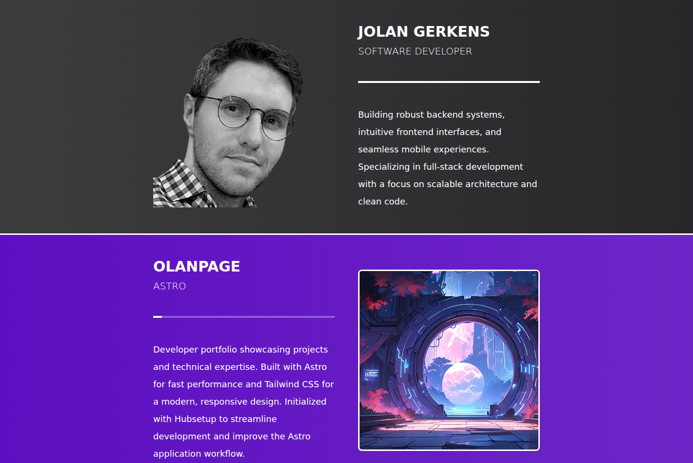

<hr>

# <samp>OVERVIEW</samp>

Developer portfolio showcasing projects and technical expertise. Built with [Astro](https://astro.build) for lightning-fast performance and [Tailwind](https://tailwindcss.com) for modern and responsive design. The project was initialized with [Hubsetup](https://github.com/olankens/hubsetup) for Astro application.

<hr>

### Website Previews



<hr>

# <samp>GUIDANCE</samp>

### Trigger GitHub Workflow

```shell
gh workflow run "create-previews.yml"
gh workflow run "deploy-gh-pages.yml"
```

<hr>

### Watch Latest Workflow

```shell
gh run watch "$(gh run list --limit 1 --json databaseId --jq '.[0].databaseId')"
```

<hr>
