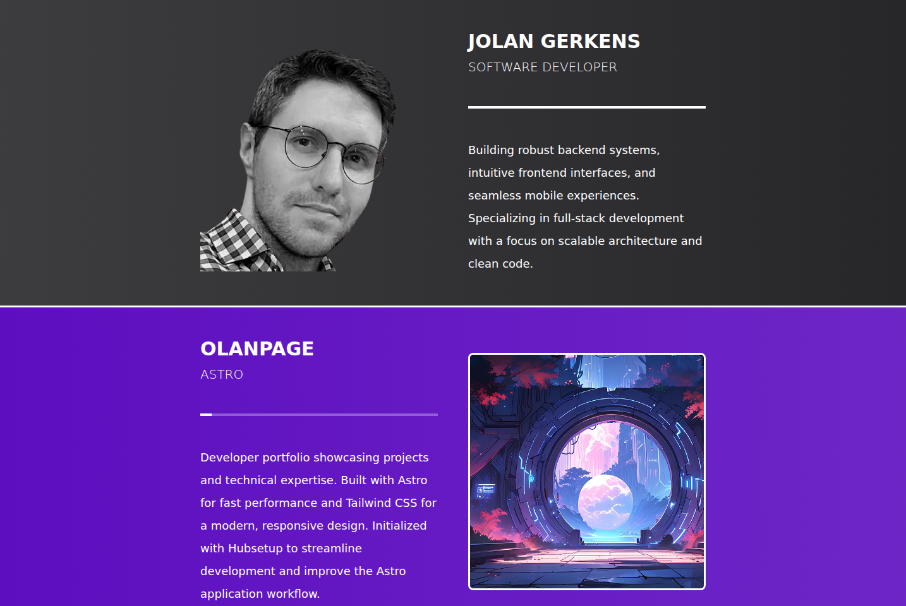
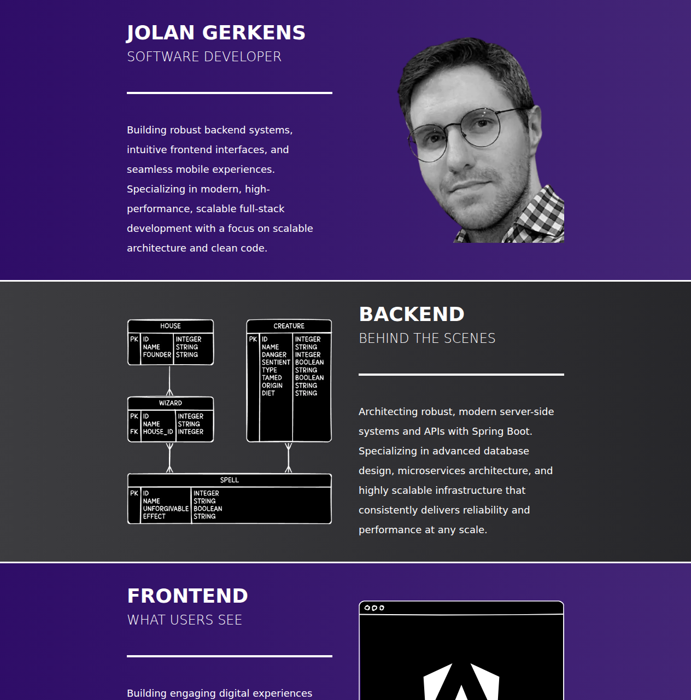
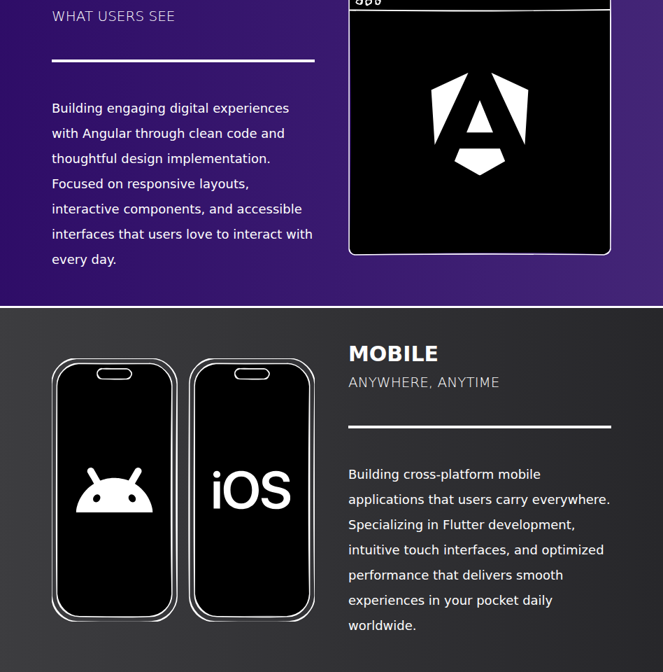
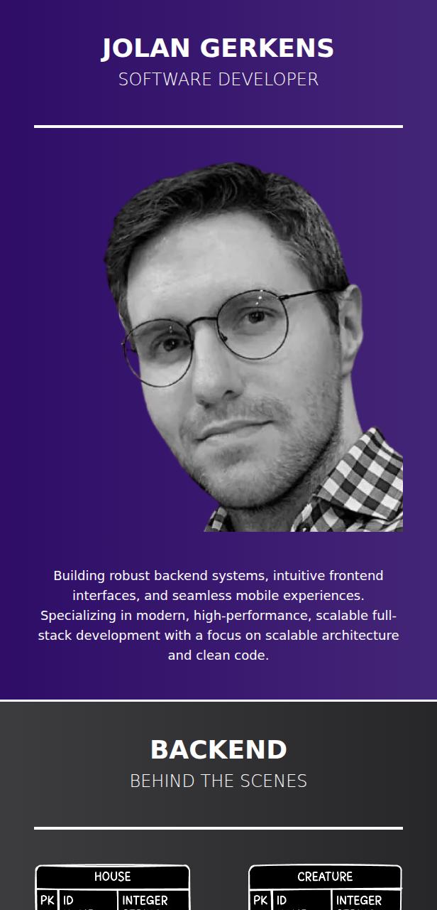
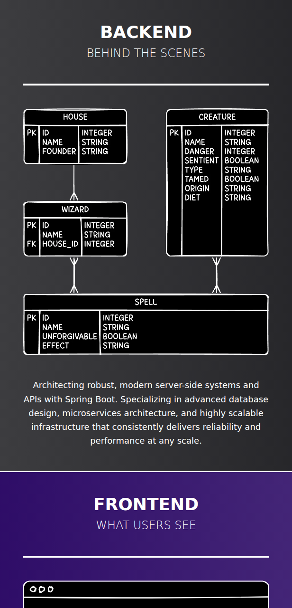
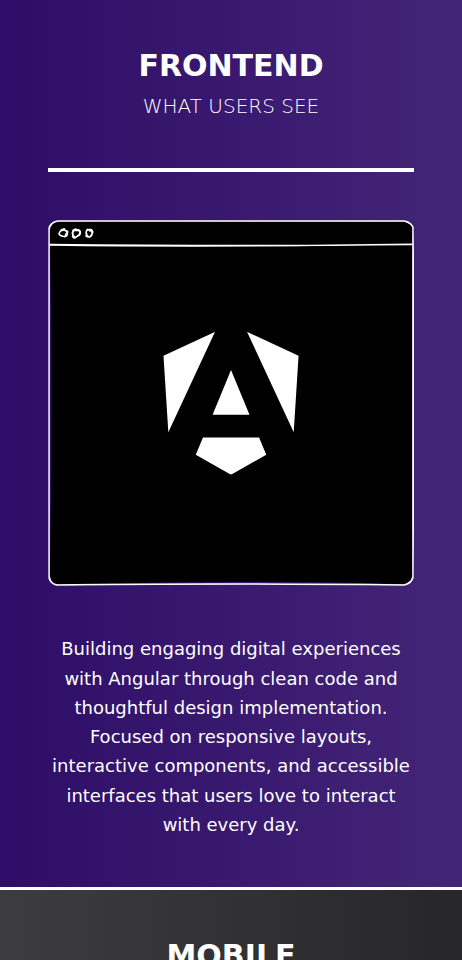
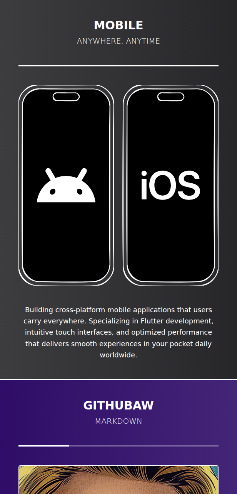

<hr>

# OVERVIEW


Developer portfolio showcasing projects and technical expertise. Built with [Astro](https://astro.build) for fast
performance and [Tailwind CSS](https://tailwindcss.com) for a modern, responsive design. Initialized with
[Hubsetup](https://github.com/olankens/hubsetup) to streamline development and improve the Astro application workflow.

<hr>

### Website Previews



<hr>

### Desktop Previews



<hr>

### Mobile Previews



<hr>

# GUIDANCE

### Trigger GitHub Workflow

```shell
gh workflow run "create-previews.yml"
gh workflow run "deploy-gh-pages.yml"
```

<hr>

### Watch Latest Workflow

```shell
gh run watch "$(gh run list --limit 1 --json databaseId --jq '.[0].databaseId')"
```

<hr>
